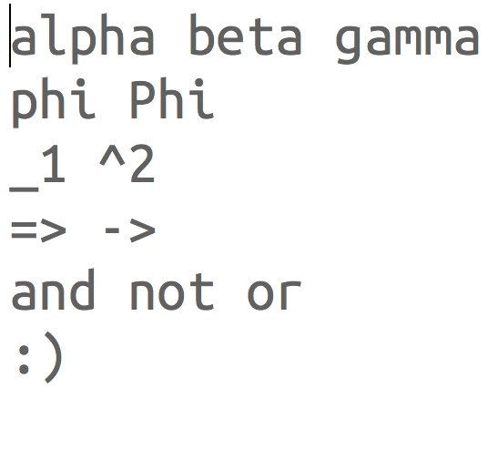

# About

This bundle helps you to quickly inserts special character into your document. For this purpose the bundle currently adds a wide range of snippets, and the commands “Replace Character (→)” and “Replace Character (←)”.

# Snippets

Each of the snippets contained in this bundle inserts a single special character. The the tab triggers for the snippets are chosen according to one of the following two criteria.

1. If the special character looks similar to a sequence of – at least two – “normal” characters, then use these characters as tab trigger. For example: To insert the special character `⇒` just write down the characters `=>` and hit `⇥`.
2. If the first criterion does not apply then use the (shortened) name of the special character. For example: To insert the character `φ` – the small greek letter phi – use the tab trigger `phi`. To insert the capital letter phi (`Φ`) use the tab trigger `Phi`.

    

# Replace Character

“Replace Character (→)” and “Replace Character (←)” convert the character to the left of the caret to another symbol. By default the commands are bound to the key combination `ctrl` + `` ` `` and `ctrl`  + `~`. Each time you press one of this key combinations the character to the left of the character is replaced by another character. The mapping between the characters is cyclic. For example, if you started with the character `o` and hit the key combination `ctrl` + `` ` ``  multiple times, then the command eventually replaces the character on the left with the letter `o` again. The configuration file (`config.yaml`) handles which character is replaced by which other character. Lets take a look at the default configuration for the letter `o`:

    - oω◦ₒ # omega, white bullet, subscript o

The above line translates to the following mapping:

    o ↔ ω
    ω ↔ ◦
    ◦ ↔ ₒ
    ₒ ↔ o

This means that if you place the caret after one of the characters on the left and invoke the command “Replace Character (→)”, then it replaces the character with the one on the right. If you invoke the command “Replace Character (←)”, on one of the the characters on the right, then it replaces it with the character to the left. Y

You can easily go back one or multiple replacement steps  just by invoking the the inverse “Replace Character” command. For example, if you mistakenly went one step too far and inserted `◦` via the command “Replace Character (→)”, although you wanted to insert `ω`, just invoke “Replace Character (←)” to go back one step to `ω`.

 The design of the default mapping for the commands is similar to the one used by the snippets contained in this bundle:

1. If there is a standard character that looks similar to the special character, then you insert the special character by invoking one of the commands (multiple times) after you placed the caret after the standard character. For example: To insert the character `₂` (subscript number 2) insert the number `2` and invoke the “Replace Character (→)” once. If you press the key combination of the command again, then it replaces `₂` with the symbol `²` (superscript number 2).
2. If there exists no standard character that looks like the symbol, then just use the first letter of the symbol to insert it. For example to add the special character `θ` (small letter **t**heta) invoke “Replace Character (→)” after you pressed the key `t`. If you invoke the command again, then it  replaces `θ` with the symbol `τ` (small letter **t**au).

    

## Edit Configuration

The “Replace Character” commands are fully customizable. To change the mappings use the included command “Edit Configuration”. The first time you call this command it copies the default configuration to `~/Library/Application Support/Special Characters/config.yaml`. It then opens this configuration file in TextMate. You can change the configuration for existing items and also add custom mapping if you like. For example, one of the lines in the default configuration looks like this:

    - 0₀⁰

The above line states that  “Replace Character (→)” replaces `0` by `₀`, `₀` by `⁰` and `⁰` by `0`. If you instead want to replace `0` by `☺` and `☺` by `0` then change this line to the following:

    - 0☺

To add a mapping just add the characters `- ` at the beginning of a line in the configuration followed by the mapping you want to add. For example, the line

    - '%💩🐶🐳🌻'

adds the following mappings between characters:

    % ↔ 💩
    💩 ↔ 🐶
    🐶 ↔ 🐳
    🐳 ↔ 🌻
    🌻 ↔ %

The mapping in the last example starts and ends with single quotes (`'`). We add these quotes since `%` is a special character in YAML. You only need to quote the mapping, if it contains characters that have special meaning in YAML. For more information about YAML, please take a look at the [Wikipedia article](https://en.wikipedia.org/wiki/YAML) about the language.

If you want to reset to the default mapping, just delete the file `~/Library/Application Support/Special Characters/config.yaml`.
